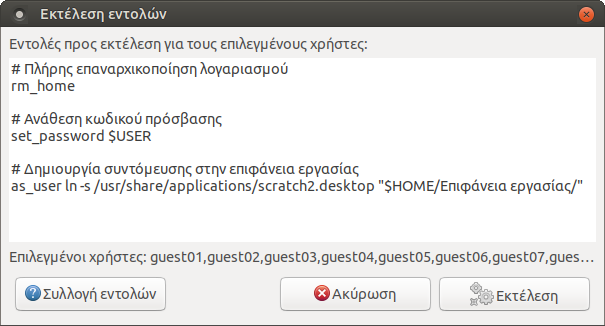

Εκτέλεση εντολών χρηστών
========================

{.align-right
width="60.0%"}

Ο διάλογος `Εκτέλεση εντολών`{.interpreted-text role="guilabel"} που
φαίνεται δεξιά επιτρέπει την εκτέλεση εντολών σε πολλούς λογαριασμούς
χρηστών ταυτόχρονα. Αντίθετα με την [Εκτέλεση εντολής του
Επόπτη](https://ts.sch.gr/wiki/Linux/epoptes/%CE%94%CE%B9%CE%B1%CE%B4%CF%81%CE%B1%CF%83%CF%84%CE%B9%CE%BA%CE%AE_%CE%B5%CE%BA%CF%80%CE%B1%CE%AF%CE%B4%CE%B5%CF%85%CF%83%CE%B7#.CE.95.CE.BA.CF.84.CE.AD.CE.BB.CE.B5.CF.83.CE.B7_.CE.B5.CE.BD.CF.84.CE.BF.CE.BB.CE.AE.CF.82_.CF.83.CF.84.CE.BF.CF.85.CF.82_.CE.B5.CF.80.CE.B9.CE.BB.CE.B5.CE.B3.CE.BC.CE.AD.CE.BD.CE.BF.CF.85.CF.82_.CF.85.CF.80.CE.BF.CE.BB.CE.BF.CE.B3.CE.B9.CF.83.CF.84.CE.AD.CF.82),
οι χρήστες δεν πρέπει να είναι συνδεδεμένοι όταν χρησιμοποιούμε αυτόν
τον διάλογο.

**Παράδειγμα χρήσης**: Είναι Σεπτέμβριος και θέλουμε να
επαναρχικοποιήσουμε όλους τους μαθητικούς λογαριασμούς. Επανεκκινούμε
τον εξυπηρετητή για να σιγουρευτούμε ότι δεν υπάρχουν αρχεία μαθητών σε
χρήση. Επιλέγουμε τις ομάδες a1, a2, b1, b2, c1, c2 ώστε να εμφανιστούν
οι σχετικοί λογαριασμοί δεξιά. Επιλέγουμε όλους τους μαθητές με
`Ctrl+A`{.interpreted-text role="kbd"} αλλά με
`Ctrl+κλικ`{.interpreted-text role="kbd"} αφαιρούμε τους καθηγητές.
Πηγαίνουμε στο μενού `Χρήστες -->
Εκτέλεση εντολών`{.interpreted-text role="menuselection"}, εισάγουμε την
εντολή `rm_home` και πατάμε το κουμπί `Εκτέλεση`{.interpreted-text
role="guilabel"}.

Οι εντολές εκτελούνται από το λογαριασμό **root**. Επιτρέπεται να
περιέχουν τις ακόλουθες μεταβλητές περιβάλλοντος: `$USER`, `$GROUP`,
`$UID`, `$GID`, `$HOME`, `$SHELL`.

Συλλογή εντολών {#collect-commands}
---------------

Ακολουθεί μια συλλογή εντολών από την οποία μπορείτε να αντιγράφετε
εντολές για να τις επικολλάτε στο διάλογο. Μπορείτε να ζητήσετε
διευκρινήσεις ή επιπλέον εντολές στο [σχετικό θέμα του
φόρουμ](https://alkisg.mysch.gr/steki/index.php?topic=8413.0).

Προκαθορισμένες εντολές {#default-commands}
-----------------------

Εκτέλεση μιας εντολής από το λογαριασμό του χρήστη αντί του root:

``` {.sourceCode .bash}
as_user [εντολή]
```

Αντιγραφή του υποδείγματος αρχικού καταλόγου `/etc/skel`:

``` {.sourceCode .bash}
cp_skel
```

Διαγραφή του μητρώου ρυθμίσεων GNOME και MATE, δηλαδή ρυθμίσεις panel,
ταπετσαρίας, θεμάτων επιφάνειας εργασίας κ.α.:

``` {.sourceCode .bash}
rm_dconf
```

Διαγραφή όλων των αρχείων και φακέλων που ξεκινάνε από τελεία `.` δηλαδή
όλων των ρυθμίσεων και δεδομένων όλων των προγραμμάτων, αλλά όχι των
αρχείων χρηστών. Έτσι για παράδειγμα θα διαγραφούν emails του
thunderbird, ρυθμίσεις του libreoffice, σελιδοδείκτες του firefox κλπ,
αλλά όχι έγγραφα .doc ή εικόνες .jpg:

``` {.sourceCode .bash}
rm_dotfiles
```

Πλήρης διαγραφή και επαναρχικοποίηση του φακέλου `/home/$USER`:

``` {.sourceCode .bash}
rm_home
```

Επαναφορά των δικαιωμάτων των αρχείων σε `$USER:$GROUP`:

``` {.sourceCode .bash}
set_owner
```

Ανάθεση κωδικού πρόσβασης αν δεν τεθεί παράμετρος τότε εννοείται η
`$USER`, δηλαδή ίδιος με το όνομα χρήστη:

``` {.sourceCode .bash}
set_password [νέος-κωδικός]
```

Εντολές διαγραφής {#delete-commands}
-----------------

Διαγραφή αρχείων προσωρινής μνήμης για απελευθέρωση χώρου:

``` {.sourceCode .bash}
rm -rf .cache .xsession-errors
```

Διαγραφή των ρυθμίσεων πολλών προγραμμάτων:

``` {.sourceCode .bash}
rm -rf .config
```

Διαγραφή των ρυθμίσεων του LibreOffice:

``` {.sourceCode .bash}
rm -rf .config/libreoffice
```

Διαγραφή των ρυθμίσεων του Firefox:

``` {.sourceCode .bash}
rm -rf .mozilla
```
