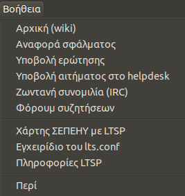

Βοήθεια
=======

{.align-right width="40.0%"}

Με το μενού `Βοήθεια`{.interpreted-text role="guilabel"} σας παρέχονται
οι εξής δυνατότητες:

-   Πληροφορίες σχετικά με την χρήση της εφαρμογής στην ιστοσελίδα [Wiki
    Τεχνικής Υποστήριξης Σχολείων](https://ts.sch.gr/wiki/Linux/LTSP).
-   Αναφορά σφαλμάτων.
-   Υποβολή ερωτημάτων που αφορούν τυχόν δυσκολίες που αντιμετωπίζετε.
-   Υποβολή αιτημάτων στο Helpdesk.
-   Ζωντανή συνομιλία μέσω [IRC web chat](https://ts.sch.gr/wiki/IRC) με
    τους υπεύθυνους ανάπτυξης.
-   Forum συζητήσεων.
-   [Χάρτης των ελληνικών
    σχολείων](https://ts.sch.gr/wiki/Linux/LTSP/Προχωρημένα/Χάρτης) στα
    οποία εφαρμόζεται η λύση του LTSP (Linux Terminal Server Project).
-   Μετάβαση στο [εγχειρίδιο χρήσης](https://ltsp.org/man/ltsp.conf/)
    του ltsp.conf.
-   Προβολή πληροφορίων για το LTSP.

    ::: {.hint}
    ::: {.admonition-title}
    Hint
    :::

    Στην αναφορά σφαλμάτων συνιστάται να περιλαμβάνονται αυτές οι
    πληροφορίες.
    :::

-   Και τέλος, πληροφορίες σχετικά με την άδεια χρήσης της εφαρμογής.
