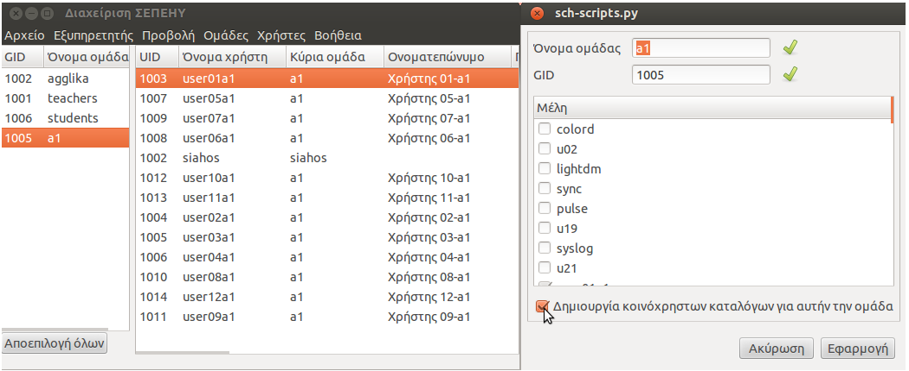

Κοινόχρηστοι κατάλογοι
======================

Για την εύκολη μεταφορά/ανταλλαγή αρχείων μεταξύ των χρηστών του ίδιου
τμήματος, τα sch-scripts δημιουργούν κοινόχρηστους καταλόγους. Στην
επιφάνεια εργασίας κάθε χρήστη δημιουργείται μια συντόμευση με όνομα
Δημόσια η οποία δείχνει στον κατάλογο `/home/username/Δημόσια`. Μέσα σε
αυτό το κατάλογο δημιουργούνται κατάλογοι ανάλογα με το τμήμα στο οποίο
ανήκουν και το ρόλο που κατέχουν (καθηγητής, μαθητής) οι χρήστες.

Πιο συγκεκριμένα, σε ένα χρήστη που έχει ρόλο
`Καθηγητή`{.interpreted-text role="guilabel"}, στην επιφάνεια εργασίας
του, μέσα στον κατάλογο `Δημόσια` δημιουργούνται τόσοι κατάλογοι όσοι
και τα τμήματα που διδάσκει με ονομασία την ονομασία των τμημάτων.
Επίσης δημιουργούνται κατάλογοι με ονομασία την ονομασία των τμημάτων
στα οποία διδάσκει και κατάληξη `- Κοινόχρηστα` και ένας κατάλογος με
ονομασία `teachers - Κοινόχρηστα`. Δηλαδή για κάθε τμήμα που διδάσκει,
του δημιουργούνται 2 κατάλογοι, ένας με όνομα τμήμα και ένας με όνομα
`τμήμα - Κοινόχρηστα`. Αντίστοιχα, σε ένα χρήστη που έχει ρόλο
`Μαθητή`{.interpreted-text role="guilabel"}, στην επιφάνεια εργασίας
του, μέσα στον κατάλογο `Δημόσια` δημιουργούνται τόσοι κατάλογοι όσοι
και οι καθηγητές που διδάσκουν στο τμήμα/τμήματα που ανήκει με ονομασία
την ονομασία των τμημάτων και κατάληξη το πραγματικό όνομα του καθηγητή.
Επίσης δημιουργούνται κατάλογοι με ονομασία την ονομασία των τμημάτων
στα οποία ανήκει και κατάληξη `- Κοινόχρηστα`.

Στους καταλόγους που έχουν κατάληξη `Κοινόχρηστα` έχουν όλοι δικαιώματα
εγγραφής και διαγραφής ανεξαρτήτως ρόλων (καθηγητής, μαθητής), ενώ στους
καταλόγους που έχουν κατάληξη το πραγματικό όνομα ενός καθηγητή, όλοι
έχουν δικαιώματα ανάγνωσης αλλά δικαιώματα εγγραφής έχει μόνο ο χρήστης
(καθηγητής) που έχει πραγματικό όνομα ίδιο με αυτό του καταλόγου.
Εξαίρεση αποτελεί ο κατάλογος `teachers - Κοινόχρηστα` ο οποίος
εμφανίζεται μόνο στους χρήστες με ρόλο `Καθηγητή`{.interpreted-text
role="guilabel"} και όλοι έχουν δικαιώματα ανάγνωσης και εγγραφής.

Για την καλύτερη κατανόηση θα δώσουμε ένα απλό παράδειγμα:

Έστω ότι στο σύστημα έχουμε δύο ομάδες `a1`{.interpreted-text
role="guilabel"} και `a2`{.interpreted-text role="guilabel"} και
υπάρχουν οι χρήστες `teacher`, `administrator`, `user01` και `user02`.
Οι χρήστες `teacher` και `user01` ανήκουν στο τμήμα
`a1`{.interpreted-text role="guilabel"} ενώ οι χρήστες `administrator`
και `user02` ανήκουν στον τμήμα `a2`{.interpreted-text role="guilabel"}.

Για τους χρήστες ισχύουν:

+\-\-\-\-\-\-\-\-\-\-\-\-\-\-\-\-\-\-\-\-\-\-\-\-\-\-\-\-\-\-\-\-\-\-\-\-\-\-\-\-\-\-\-\-\-\-\-\-\-\-\-\-\-\-\-\--+
\| Ρόλοι Χρηστών \|
+\-\-\-\-\-\-\-\-\-\-\-\-\-\--+\-\-\-\-\-\-\-\-\-\-\-\-\-\-\-\-\--+\-\-\-\-\-\-\-\-\-\-\-\-\--+\-\-\-\-\-\--+
\| Όνομα χρήστη \| Πραγματικό όνομα \| Ρόλος \| Τμήμα \|
+===============+==================+==============+=======+ \|
administrator \| Υπεύθυνος ΣΕΠΕΗΥ \| Διαχειριστής \| a2 \|
+\-\-\-\-\-\-\-\-\-\-\-\-\-\--+\-\-\-\-\-\-\-\-\-\-\-\-\-\-\-\-\--+\-\-\-\-\-\-\-\-\-\-\-\-\--+\-\-\-\-\-\--+
\| user02 \| Χρήστης 02 \| Μαθητής \| a2 \|
+\-\-\-\-\-\-\-\-\-\-\-\-\-\--+\-\-\-\-\-\-\-\-\-\-\-\-\-\-\-\-\--+\-\-\-\-\-\-\-\-\-\-\-\-\--+\-\-\-\-\-\--+
\| teacher \| Καθηγητής 01 \| Καθηγητής \| a1 \|
+\-\-\-\-\-\-\-\-\-\-\-\-\-\--+\-\-\-\-\-\-\-\-\-\-\-\-\-\-\-\-\--+\-\-\-\-\-\-\-\-\-\-\-\-\--+\-\-\-\-\-\--+
\| user01 \| Χρήστης 01 \| Μαθητής \| a1 \|
+\-\-\-\-\-\-\-\-\-\-\-\-\-\--+\-\-\-\-\-\-\-\-\-\-\-\-\-\-\-\-\--+\-\-\-\-\-\-\-\-\-\-\-\-\--+\-\-\-\-\-\--+

Τα sch-scripts θα δημιουργήσουν τους παρακάτω κοινόχρηστους καταλόγους
μέσα στον κατάλογο Δημόσια του κάθε χρήστη:

+\-\-\-\-\-\-\-\-\-\-\-\-\-\-\-\-\-\-\-\-\-\-\-\-\-\-\-\-\-\-\-\-\-\-\-\-\-\-\-\-\-\-\-\-\-\-\--+
\| Κοινόχρηστοι κατάλογοι \|
+\-\-\-\-\-\-\-\-\-\-\-\-\-\--+\-\-\-\-\-\--+\-\-\-\-\-\-\-\-\-\-\-\-\-\-\-\-\-\-\-\-\-\-\--+
\| Όνομα χρήστη \| Τμήμα \| Κατάλογοι \|
+===============+=======+========================+ \| teacher \| a1 \|
a1 \| \| \| +\-\-\-\-\-\-\-\-\-\-\-\-\-\-\-\-\-\-\-\-\-\-\--+ \| \| \|
a1 - Κοινόχρηστα \| \| \|
+\-\-\-\-\-\-\-\-\-\-\-\-\-\-\-\-\-\-\-\-\-\-\--+ \| \| \| teachers -
Κοινόχρηστα \|
+\-\-\-\-\-\-\-\-\-\-\-\-\-\--+\-\-\-\-\-\--+\-\-\-\-\-\-\-\-\-\-\-\-\-\-\-\-\-\-\-\-\-\-\--+
\| user01 \| a1 \| a1 - Κοινόχρηστα \| \| \|
+\-\-\-\-\-\-\-\-\-\-\-\-\-\-\-\-\-\-\-\-\-\-\--+ \| \| \| a1 -
Καθηγητής 01 \|
+\-\-\-\-\-\-\-\-\-\-\-\-\-\--+\-\-\-\-\-\--+\-\-\-\-\-\-\-\-\-\-\-\-\-\-\-\-\-\-\-\-\-\-\--+
\| administrator \| a2 \| a2 \| \| \|
+\-\-\-\-\-\-\-\-\-\-\-\-\-\-\-\-\-\-\-\-\-\-\--+ \| \| \| a2 -
Κοινόχρηστα \| \| \| +\-\-\-\-\-\-\-\-\-\-\-\-\-\-\-\-\-\-\-\-\-\-\--+
\| \| \| teachers - Κοινόχρηστα \|
+\-\-\-\-\-\-\-\-\-\-\-\-\-\--+\-\-\-\-\-\--+\-\-\-\-\-\-\-\-\-\-\-\-\-\-\-\-\-\-\-\-\-\-\--+
\| user02 \| a2 \| a2 - Κοινόχρηστα \| \| \|
+\-\-\-\-\-\-\-\-\-\-\-\-\-\-\-\-\-\-\-\-\-\-\--+ \| \| \| a2 -
Υπεύθυνος ΣΕΠΕΗΥ \|
+\-\-\-\-\-\-\-\-\-\-\-\-\-\--+\-\-\-\-\-\--+\-\-\-\-\-\-\-\-\-\-\-\-\-\-\-\-\-\-\-\-\-\-\--+

Οι αντιστοιχήσεις των καταλόγων είναι:

+\-\-\-\-\-\-\-\-\-\-\-\-\-\-\-\-\-\-\-\-\-\-\-\-\-\-\-\-\-\-\-\-\-\-\-\-\-\-\-\-\-\-\--+
\| Αντιστοιχήσεις καταλόγων \|
+\-\-\-\-\-\-\-\-\-\-\-\-\-\-\-\-\-\-\--+\-\-\-\-\-\-\-\-\-\-\-\-\-\-\-\-\-\-\-\-\-\--+
\| Κατάλογος Καθηγητή \| Κατάλογος Μαθητή \|
+====================+=======================+ \| a1 \| a1 - Καθηγητής
01 \|
+\-\-\-\-\-\-\-\-\-\-\-\-\-\-\-\-\-\-\--+\-\-\-\-\-\-\-\-\-\-\-\-\-\-\-\-\-\-\-\-\-\--+
\| a1 - Κοινόχρηστα \| a1 - Κοινόχρηστα \|
+\-\-\-\-\-\-\-\-\-\-\-\-\-\-\-\-\-\-\--+\-\-\-\-\-\-\-\-\-\-\-\-\-\-\-\-\-\-\-\-\-\--+
\| a2 \| a2 - Υπεύθυνος ΣΕΠΕΗΥ \|
+\-\-\-\-\-\-\-\-\-\-\-\-\-\-\-\-\-\-\--+\-\-\-\-\-\-\-\-\-\-\-\-\-\-\-\-\-\-\-\-\-\--+
\| a1 - Κοινόχρηστα \| a1 - Κοινόχρηστα \|
+\-\-\-\-\-\-\-\-\-\-\-\-\-\-\-\-\-\-\--+\-\-\-\-\-\-\-\-\-\-\-\-\-\-\-\-\-\-\-\-\-\--+

::: {.note}
::: {.admonition-title}
Note
:::

Στο παραπάνω πίνακα δεν εμφανίζεται ο κατάλογος `teachers - Κοινόχρηστα`
γιατί δεν είναι ορατός στους χρήστες με ρόλο `Μαθητή`{.interpreted-text
role="guilabel"}. Είναι ορατός μόνο στους χρήστες με ρόλο
`Καθηγητή`{.interpreted-text role="guilabel"} και χρησιμεύει στη
μεταφορά αρχείων μεταξύ των καθηγητών ενός σχολείου.
:::

Τώρα, εάν υποθέσουμε ότι όλοι οι χρήστες ανήκουν σε όλα τα τμήματα τότε
ο πίνακας των κοινόχρηστων καταλόγων γίνεται ως εξής:

Δημιουργία κοινόχρηστων καταλόγων
---------------------------------

{.align-right
width="60.0%"}

Για να δημιουργήσετε τους κοινόχρηστους καταλόγους σε μια ομάδα:

1.  Επιλέξτε την ομάδα που επιθυμείτε από την λίστα που βρίσκεται στα
    αριστερά της αρχικής οθόνης της εφαρμογής,
2.  Επιλέξτε το μενού
    `Ομάδες  -->  Επεξεργασίας ομάδας`{.interpreted-text
    role="menuselection"}.
3.  Επιλέξτε `Δημιουργία κοινοχρήστων καταλόγων`{.interpreted-text
    role="guilabel"} για αυτήν την ομάδα.
4.  Τέλος, πατήστε `Εφαρμογή`{.interpreted-text role="guilabel"}.

::: {.warning}
::: {.admonition-title}
Warning
:::

Εάν οι χρήστες του τμήματος είναι ήδη συνδεδεμένοι στο σύστημα, δεν θα
δουν κατευθείαν τους καταλόγους. Θα πρέπει να κάνουν αποσύνδεση και
σύνδεση εκ νέου.
:::

Κατάργηση κοινόχρηστων καταλόγων
--------------------------------

Για να καταργήσετε του κοινόχρηστους φακέλους σε μια ομάδα:

1.  Επιλέξτε την ομάδα που επιθυμείτε από την λίστα που βρίσκεται στα
    αριστερά της αρχικής οθόνης της εφαρμογής,
2.  Επιλέξτε το μενού
    `Ομάδες  -->  Επεξεργασίας ομάδας`{.interpreted-text
    role="menuselection"}.
3.  Από-επιλέξτε `Δημιουργία κοινοχρήστων καταλόγων`{.interpreted-text
    role="guilabel"} για αυτήν την ομάδα.
4.  Τέλος, πατήστε `Εφαρμογή`{.interpreted-text role="guilabel"}.

::: {.hint}
::: {.admonition-title}
Hint
:::

Κατά την κατάργηση των κοινόχρηστων καταλόγων τα αρχεία παραμένουν στο
φάκελο `/home/Shared/groupX` με σκοπό την αποφυγή απώλειας σημαντικών
αρχείων. Η οριστική τους διαγραφή μπορεί να επιτευχθεί μόνο από τον
`administrator` μέσω του Ναυτίλου.
:::

Τεχνικό υπόβαθρο
----------------

Τα sch-scripts υλοποιούν την παρακάτω δομή για κοινόχρηστους φακέλους:

+------------------------+-------------+-------------+----------------+
| Φάκελος                | Ιδιοκτήτης  | Ομάδα       | Δικαιώματα     |
+========================+=============+=============+================+
| > /home/Shared         | administrat | administrat | rwx\--x\--x    |
|                        | or          | or          | (711)          |
+------------------------+-------------+-------------+----------------+
| > /home/Shared/a1      | administrat | > a1        | rwxrwx\-\--    |
|                        | or          |             | (770)          |
+------------------------+-------------+-------------+----------------+
| > /home/Shared/a2      | administrat | > a2        | rwxrwx\-\--    |
|                        | or          |             | (770)          |
+------------------------+-------------+-------------+----------------+
| > /home/teachers       | administrat | > teachers  | rwxrwx\-\--    |
|                        | or          |             | (770)          |
+------------------------+-------------+-------------+----------------+
| /home/teacherX/Δημόσια | > teacherX  | > a1        | rwxr-x\-\--    |
| /a1                    |             |             | (750)          |
+------------------------+-------------+-------------+----------------+
| /home/teacherX/Δημόσια | > teacherX  | > a2        | rwxr-x\-\--    |
| /a2                    |             |             | (750)          |
+------------------------+-------------+-------------+----------------+

-   Ο `administrator`{.interpreted-text role="guilabel"} είναι ο χρήστης
    που εγκατέστησε το Ubuntu (με `UID=1000`{.interpreted-text
    role="guilabel"}) και είναι ο ιδιοκτήτης όλων των φακέλων και των
    αρχείων κάτω από το `/home/Shared`, ώστε να μπορεί να μετακινεί ή να
    διαγράφει φακέλους και αρχεία κατευθείαν από το Ναυτίλο χωρίς να
    χρειάζεται να εκτελέσει την εντολή `sudo`.
-   Οι κατάλογοι `/home/Shared/groupX` έχουν δικαιώματα ανάγνωσης και
    εγγραφής από οποιονδήποτε ανήκει στο τμήμα `groupX`, είτε μαθητές
    είτε καθηγητές. Αυτοί αποτελούν το χώρο συνεργασίας των μαθητών, για
    ανταλλαγή αρχείων, για τα projects κτλ. Στην επιφάνεια εργασίας,
    μέσα στον φάκελο `Δημόσια` εμφανίζονται ως `groupX - Κοινόχρηστα`.
-   Οι κατάλογοι `/home/Shared/teachers` έχουν δικαιώματα ανάγνωσης και
    εγγραφής μόνο από τους καθηγητές. Αυτοί αποτελούν το χώρο
    συνεργασίας των καθηγητών, για ανταλλαγή αρχείων κτλ. Στην επιφάνεια
    εργασίας, μέσα στον φάκελο Δημόσια εμφανίζονται ως
    `teachers - Κοινόχρηστα`.
-   Οι κατάλογοι `/home/teacherX/Δημόσια/groupX` έχουν δικαιώματα
    ανάγνωσης από όλους τους χρήστες του τμήματος `groupX` αλλά έχουν
    δικαιώματα εγγραφής μόνο από το χρήστη `teacherX`. Στην επιφάνεια
    εργασίας, μέσα στον φάκελο `Δημόσια` του `teacherX` εμφανίζονται ως
    `groupX` αλλά στην επιφάνεια εργασίας, μέσα στον φάκελο `Δημόσια`
    των μαθητών του `groupX` εμφανίζονται ως
    `groupX - (πραγματικό όνομα)teacherX`.

Κατά τη σύνδεση οποιουδήποτε χρήστη στο σύστημα, είτε μαθητή είτε
καθηγητή, δημιουργούνται συντομεύσεις για τους κοινόχρηστους φακέλους
των τμημάτων που ανήκει, όπως περιγράφεται παραπάνω. Συνοπτικά,

+----+---+------------------+-----+----------------------------------+
| Χρ | Ο | Ονομασία         | Συν | Προορισμός συντόμευσης           |
| ήσ | μ | καταλόγου        | τόμ |                                  |
| τη | ά |                  | ευσ |                                  |
| ς  | δ |                  | η   |                                  |
|    | ε |                  |     |                                  |
|    | ς |                  |     |                                  |
+====+===+==================+=====+==================================+
| >  | > | > a1 -           | > Ν | > /home/Shared/a1                |
| us |   | > Κοινόχρηστα    | αι  |                                  |
| er | a |                  |     |                                  |
| 1  | 1 |                  |     |                                  |
+----+---+------------------+-----+----------------------------------+
| >  | > | a1 - Πραγματικό  | > Ν | /home/Shared/.symlinks/a1 -      |
| us |   | όνομα του        | αι  | teacher1 =\>                     |
| er | a | teacher1         |     | /home/teacher1/Δημόσια/a1        |
| 1  | 1 |                  |     |                                  |
+----+---+------------------+-----+----------------------------------+
| >  | > | > a2 -           | > Ν | > /home/Shared/a2                |
| us |   | > Κοινόχρηστα    | αι  |                                  |
| er | a |                  |     |                                  |
| 2  | 2 |                  |     |                                  |
+----+---+------------------+-----+----------------------------------+
| >  | > | a2 - Πραγματικό  | > Ν | /home/Shared/.symlinks/a2 -      |
| us |   | όνομα του        | αι  | teacher2 =\>                     |
| er | a | teacher2         |     | /home/teacher2/Δημόσια/a2        |
| 2  | 2 |                  |     |                                  |
+----+---+------------------+-----+----------------------------------+
| te | > | > a1             | > Ό | > \--                            |
| ac |   |                  | χι  |                                  |
| he | a |                  |     |                                  |
| r1 | 1 |                  |     |                                  |
+----+---+------------------+-----+----------------------------------+
| te | > | > a1 -           | > Ν | > /home/Shared/a1                |
| ac |   | > Κοινόχρηστα    | αι  |                                  |
| he | a |                  |     |                                  |
| r1 | 1 |                  |     |                                  |
+----+---+------------------+-----+----------------------------------+
| te | > | > teachers -     | > Ν | > /home/Shared/teachers          |
| ac |   | > Κοινόχρηστα    | αι  |                                  |
| he | a |                  |     |                                  |
| r1 | 1 |                  |     |                                  |
+----+---+------------------+-----+----------------------------------+
| te | > | > a2             | > Ό | > \--                            |
| ac |   |                  | χι  |                                  |
| he | a |                  |     |                                  |
| r2 | 2 |                  |     |                                  |
+----+---+------------------+-----+----------------------------------+
| te | > | > a2 -           | > Ν | > /home/Shared/a2                |
| ac |   | > Κοινόχρηστα    | αι  |                                  |
| he | a |                  |     |                                  |
| r2 | 2 |                  |     |                                  |
+----+---+------------------+-----+----------------------------------+
| te | > | > teachers -     | > Ν | > /home/Shared/teachers          |
| ac |   | > Κοινόχρηστα    | αι  |                                  |
| he | a |                  |     |                                  |
| r2 | 2 |                  |     |                                  |
+----+---+------------------+-----+----------------------------------+

Τεχνικά, η υλοποίηση γίνεται με τον εξής τρόπο:

-   Τα sch-scripts εγκαθιστούν το βοήθημα
    [bindfs](https://manpages.ubuntu.com/manpages/focal/en/man1/bindfs.1.html),
    το οποίο δίνει τη δυνατότητα προσάρτησης ενός φακέλου και των
    περιεχομένων του με συγκεκριμένα δικαιώματα, παρακάμπτοντας το
    κλασσικό σύστημα δικαιωμάτων του Linux, το οποίο δεν βολεύει για
    κοινόχρηστους φακέλους.
-   Επίσης, εγκαθιστούν την υπηρεσία `/etc/init/sch-scripts`, η οποία
    εκτελείται κατά την εκκίνηση του υπολογιστή, αλλά και επανεκκινείται
    κάθε φορά που γίνεται ενεργοποίηση κοινόχρηστων φακέλων μέσα από τα
    sch-scripts. Η υπηρεσία αυτή ελέγχει ποιοι κοινόχρηστοι φάκελοι
    υπάρχουν και τους προσαρτά με το bindfs.
-   Τέλος, το πρόγραμμα `/etc/xdg/autostart/sch-scripts.desktop`
    εκτελείται κατά τη σύνδεση κάθε χρήστη, και δημιουργεί συντομεύσεις
    για τους κοινόχρηστους φακέλους για όσα group ανήκει, ενώ ταυτόχρονα
    διαγράφει τυχόν συντομεύσεις για group που δεν ανήκει πια.
-   Ένα ακόμα σημείο είναι ότι στους fat πελάτες ο φάκελος
    `/home/Shared` προσαρτάται από το server με την εντολή
    `LOCALAPPS_EXTRA_MOUNTS=/home/Shared` του `lts.conf`.

Μπορείτε να ρυθμίσετε τα ονόματα των φακέλων από το αρχείο
`/etc/default/sch-scripts`, το οποίο και μπορείτε να επεξεργαστείτε από
το μενού `Εξυπηρετητής  -->  Αρχεία ρυθμίσεων  -->
Ρυθμίσεις --> sch-scripts`{.interpreted-text role="menuselection"} των
sch-scripts.

+---+---+---+
| W | W | W |
| i | i | i |
| d | d | d |
| t | t | t |
| h | h | h |
| 5 | 3 | 1 |
| 0 | 3 | 6 |
| % | % | % |
+===+===+===+
| L | T | T |
| i | h | h |
| n | i | i |
| e | s | s |
| 1 | t | t |
|   | e | e |
|   | x | x |
|   | t | t |
|   | s | w |
|   | h | i |
|   | o | l |
|   | u | l |
|   | l | a |
|   | d | l |
|   | w | w |
|   | r | a |
|   | a | y |
|   | p | s |
|   | o | b |
|   | n | e |
|   | t | o |
|   | o | n |
|   | m | e |
|   | u | l |
|   | l | i |
|   | t | n |
|   | i | e |
|   | p | . |
|   | l |   |
|   | e |   |
|   | l |   |
|   | i |   |
|   | n |   |
|   | e |   |
|   | s |   |
|   | . |   |
+---+---+---+
| L | C | R |
| i | e | i |
| n | n | g |
| e | t | h |
| 2 | e | t |
|   | r | - |
|   | e | A |
|   | d | l |
|   | . | i |
|   |   | g |
|   |   | n |
|   |   | e |
|   |   | d |
|   |   | . |
+---+---+---+
| L | C | R |
| i | e | i |
| n | n | g |
| e | t | h |
| 3 | e | t |
|   | r | - |
|   | e | A |
|   | d | l |
|   | A | i |
|   | g | g |
|   | a | n |
|   | i | e |
|   | n | d |
|   | . | A |
|   |   | g |
|   |   | a |
|   |   | i |
|   |   | n |
|   |   | . |
+---+---+---+
