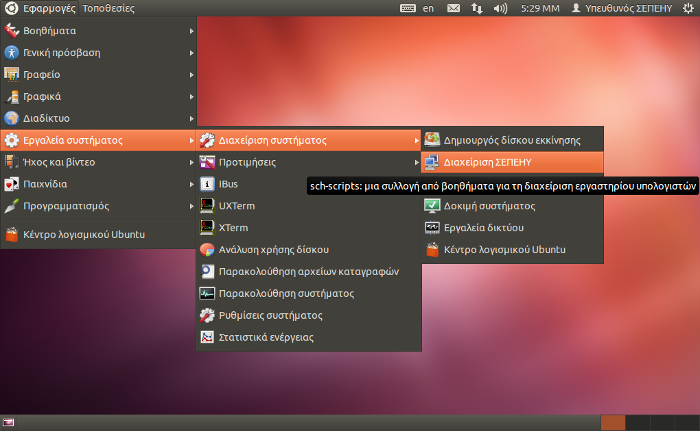

Εκκίνηση
========

::: {.sidebar}
**TODO testing sidebar**


:::

Η εκκίνηση της εφαρμογής μπορεί να πραγματοποιηθεί με τρεις τρόπους:

-   Πηγαίνοντας στο μενού `Εφαρμογές --> Εργαλεία συστήματος -->
    Διαχείριση συστήματος --> Διαχείριση ΣΕΠΕΗΥ`{.interpreted-text
    role="menuselection"}, όπως υποδεικνύεται στην εικόνα στα δεξιά.
-   Πατώντας `Alt-F2`{.interpreted-text role="kbd"} για να εμφανιστεί ο
    διάλογος εκτέλεσης εντολής και πληκτρολογώντας `sch-scripts`.
-   Ανοίγοντας ένα τερματικό (πατώντας `Alt-Ctrl-T`{.interpreted-text
    role="kbd"} ή πηγαίνοντας στο μενού
    `Εφαρμογές --> Βοηθήματα --> Τερματικό`{.interpreted-text
    role="menuselection"}) και αντιγράφοντας την παρακάτω εντολή:

``` {.sourceCode .bash}
sch-scripts
```

::: {.note}
::: {.admonition-title}
Note
:::

Με οποιονδήποτε τρόπο και εάν επιλέξετε την έναρξη της εφαρμογής θα σας
ζητηθεί να εισάγετε τον κωδικό διαχειριστή του συστήματος. Η εκτέλεση
της εφαρμογής `sch-scripts`{.interpreted-text role="ref"} σε αντίθεση με
την [epoptes]{.title-ref} απαιτεί δικαιώματα διαχείρισης (root).
:::

Αρχική οθόνη της εφαρμογής {#first-screen}
--------------------------

{.align-right width="40.0%"}

Η πρώτη οθόνη που εμφανίζεται στον χρήστη μετά την έναρξη της εφαρμογής
φαίνεται στην εικόνα στα δεξιά. Η διεπαφή της εφαρμογής ουσιαστικά
χωρίζεται σε τρία μέρη:

-   Το μενού επιλογών στο πάνω μέρος,
-   Την εμφάνιση των ομάδων (groups) στα αριστερά,
-   Και τέλος, την περιοχή στην οποία εμφανίζονται οι χρήστες του
    συστήματος στα δεξιά και η οποία καταλαμβάνει το μεγαλύτερο μέρος
    της διεπαφής.

Το κυρίως μενού αποτελείται από τις επιλογές `Αρχείο`{.interpreted-text
role="guilabel"}, `Εξυπηρετητής`{.interpreted-text role="guilabel"},
`Προβολή`{.interpreted-text role="guilabel"},
`Χρήστες`{.interpreted-text role="guilabel"}, `Ομάδες`{.interpreted-text
role="guilabel"} και `Βοήθεια`{.interpreted-text role="guilabel"}. Με
τις επιλογές αυτές ο διαχειριστής του εργαστηρίου μπορεί να δημιουργήσει
τον εικονικό δίσκο από τον οποίο θα εκκινούνται οι σταθμοί εργασίας, να
συντηρήσει το περιβάλλον των σταθμών εργασίας καθώς και να
δημιουργήσει/επεξεργαστεί του χρήστες στο σύστημα.

Με το κομμάτι της διεπαφής που βρίσκεται στα αριστερά της εφαρμογής
μπορείτε να δημιουργήσετε / επεξεργαστείτε τις ομάδες χρηστών.

Τέλος, στο υπόλοιπο κομμάτι της διεπαφής παρουσιάζονται όπως
προαναφέρθηκε οι χρήστες του συστήματος καθώς και διάφορες πληροφορίες
τους.

::: {.hint}
::: {.admonition-title}
Hint
:::

Η περιοχή μεταξύ των δύο τελευταίων μπορεί να μεταβληθεί μετακινώντας
την θέση της διαχωριστικής στήλης.

Η σειρά με την οποία εμφανίζονται οι χρήστες μπορείτε να την
τροποποιήσετε κάνοντας κλικ πάνω στην επικεφαλίδα της λίστας εκείνης
σύμφωνα με την οποία επιθυμείτε να τους αναδιατάξετε.
:::
