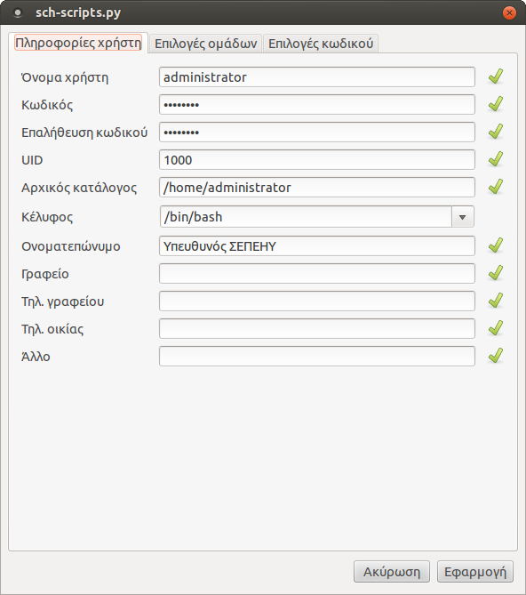
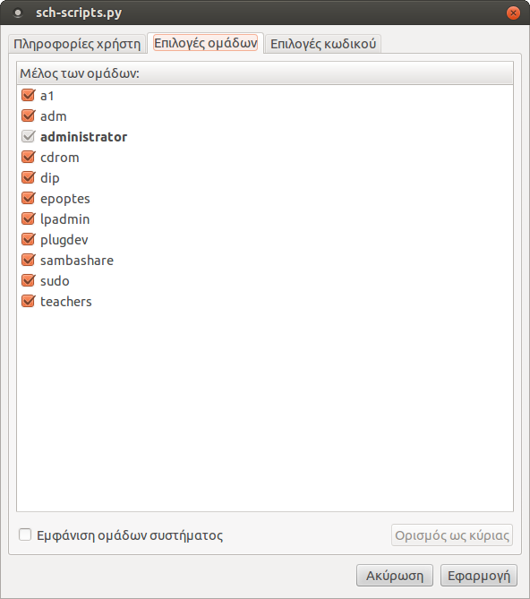
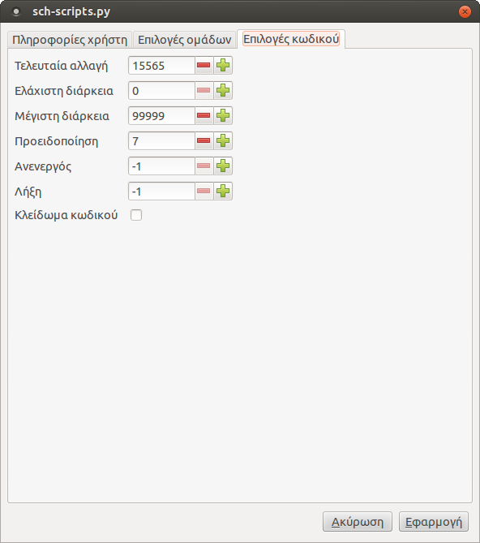

Επεξεργασία χρηστών
===================

Η εφαρμογή `sch-scripts`{.interpreted-text role="ref"} δίνει την
δυνατότητα επεξεργασίας των στοιχείων των χρηστών του συστήματος. Για να
επεξεργαστείτε τα στοιχεία ενός χρήστη μπορείτε να χρησιμοποιήσετε το
μενού `Χρήστες --> Επεξεργασία
χρήστη`{.interpreted-text role="menuselection"} αφού πρώτα έχετε
επιλέξει τον επιθυμητό χρήστη από την λίστα της αρχικής οθόνης της
εφαρμογής. Εναλλακτικά, μπορείτε από το μενού
`Επεξεργασία χρήστη`{.interpreted-text role="guilabel"} του αναδυόμενου
μενού που θα σας εμφανιστεί κάνοντας δεξί κλικ ή διπλό κλικ στον
επιλεγμένο χρήστη.

Στον διάλογο που θα σας εμφανιστεί, υπάρχουν 3 καρτέλες.

-   `Πληροφορίες χρήστη`{.interpreted-text role="guilabel"}: Στην
    καρτέλα αυτή, εμφανίζονται πληροφορίες όπως όνομα χρήστη, UID,
    αρχικός κατάλογος, ονοματεπώνυμο, κλπ.
-   `Επιλογές ομάδων`{.interpreted-text role="guilabel"}: Στην καρτέλα
    αυτή, εμφανίζονται οι ομάδες στις οποίες ανήκει ο επιλεγμένος
    χρήστης.
-   `Επιλογές κωδικού`{.interpreted-text role="guilabel"}: Στην καρτέλα
    αυτή, εμφανίζονται διάφορες προτιμήσεις του κωδικού πρόσβασης του
    επιλεγμένου χρήστη.

{.align-right width="40.0%"}

Στην καρτέλα `Πληροφορίες χρήστη`{.interpreted-text role="guilabel"},
μπορείτε:

-   Να αλλάξετε το όνομα χρήστη, τροποποιώντας το πεδίο `Όνομα
    χρήστη`{.interpreted-text role="guilabel"}.
-   Να ορίσετε καινούριο κωδικό πρόσβασης (σε περίπτωση απώλειας του),
    δίνοντας τον καινούριο κωδικό στα πεδία `Κωδικός`{.interpreted-text
    role="guilabel"} και `Επαλήθευση
    κωδικού`{.interpreted-text role="guilabel"}.

    ::: {.note}
    ::: {.admonition-title}
    Note
    :::

    Η προβολή του κωδικού σε ένα σύστημα Linux δεν επιτρέπεται. Οι
    κωδικοί πρόσβασης των χρηστών του συστήματος είναι κρυπτογραφημένοι.
    Σε περίπτωση απώλειας του κωδικού πρόσβασης, θα πρέπει να οριστεί εκ
    νέου καινούριος.
    :::

-   Να ορίσετε καινούριο UID από το πεδίο `UID`{.interpreted-text
    role="guilabel"}.
-   Να ορίσετε διαφορετικό αρχικό κατάλογο, δίνοντας διαφορετική
    διαδρομή καταλόγου στο πεδίο `Αρχικός κατάλογος`{.interpreted-text
    role="guilabel"}.

    ::: {.note}
    ::: {.admonition-title}
    Note
    :::

    Ο αρχικός κατάλογος, συνήθως βρίσκεται στον κατάλογο
    `/home`{.interpreted-text role="file"} και έχει όνομα ίδιο με αυτό
    του ονόματος χρήστη (πεδίο: `Όνομα
    χρήστη`{.interpreted-text role="guilabel"}).
    :::

-   Να αλλάξετε το ονοματεπώνυμο, τροποποιώντας το πεδίο
    `Ονοματεπώνυμο`{.interpreted-text role="guilabel"}.

{.align-right width="40.0%"}

Στην καρτέλα `Επιλογές ομάδων`{.interpreted-text role="guilabel"},
μπορείτε:

-   Να επιλέξετε ή να από-επιλέξετε τις ομάδες που επιθυμείτε να ανήκει
    ο χρήστης.

    ::: {.hint}
    ::: {.admonition-title}
    Hint
    :::

    Εάν επιθυμείτε να χρησιμοποιήσετε κάποια από τις ομάδες συστήματος
    (system groups) επιλέξτε το
    `Εμφάνιση ομάδων συστήματος`{.interpreted-text role="guilabel"}.
    :::

{.align-right width="40.0%"}

Τέλος, στην καρτέλα `Επιλογές κωδικού`{.interpreted-text
role="guilabel"}, μπορείτε:

-   Να ορίσετε την μέγιστη διάρκεια του κωδικού (πχ: 365 ημέρες),
    αλλάζοντας την τιμή του πεδίου `Μέγιστη διάρκεια`{.interpreted-text
    role="guilabel"}.
-   Να κλειδώσετε τον κωδικό, επιλέγοντας
    `Κλείδωμα κωδικού`{.interpreted-text role="guilabel"} με σκοπό την
    απαγόρευση αλλαγής του.
