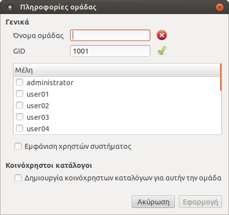
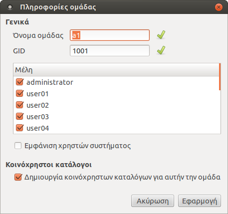

Ομάδες
======

Η εφαρμογή `sch-scripts`{.interpreted-text role="ref"} παρέχει την
δυνατότητα δημιουργίας ομάδων (τμήματα) για την κατηγοριοποίηση των
χρηστών και την ανταλλαγή αρχείων μεταξύ χρηστών της ίδιας ομάδας μέσω
των κοινόχρηστων καταλόγων.

Δημιουργία ομάδας
-----------------

{.align-right width="40.0%"}

Για να δημιουργήσετε μια ομάδα:

1.  Κάντε κλικ στο μενού `Ομάδες --> Νέα ομάδα`{.interpreted-text
    role="menuselection"} ή στο `Νέα ομάδα`{.interpreted-text
    role="guilabel"} από το αναδυόμενο μενού που θα σας εμφανιστεί
    κάνοντας δεξί κλικ στην λίστα που βρίσκεται στα αριστερά της αρχικής
    οθόνης της εφαρμογής. Ο διάλογος που θα σας εμφανιστεί φαίνεται στην
    εικόνα δεξιά.
2.  Στο πεδίο `Όνομα ομάδας`{.interpreted-text role="guilabel"} δώστε το
    επιθυμητό όνομα.
3.  Επιλέξτε τους χρήστες που επιθυμείτε να εντάξετε στην ομάδα.
4.  Επιλέξτε [Δημιουργία κοινόχρηστων καταλόγων για αυτήν την
    ομάδα](shared-folders) εάν το επιθυμείτε.
5.  Τέλος, πατήστε `Εφαρμογή`{.interpreted-text role="guilabel"}.

::: {.note}
::: {.admonition-title}
Note
:::

-   Στο πεδίο `Όνομα ομάδας`{.interpreted-text role="guilabel"} μπορείτε
    να δώσετε μόνο λατινικούς χαρακτήρες. Σε περίπτωση που δώσετε
    ελληνικούς τότε το εικονίδιο [TODO: Gtk-stop.png]{.title-ref}
    (εικονίδιο για την δήλωση κάποιου λάθους) θα παραμείνει. Επίσης το
    `Εφαρμογή`{.interpreted-text role="guilabel"} θα παραμείνει
    ανενεργό. Την ίδια συμπεριφορά θα συναντήσετε και όταν δώσετε ένα
    όνομα ομάδας το οποίο υπάρχει ήδη στο σύστημα.
-   Στο πεδίο `GID`{.interpreted-text role="guilabel"} υπάρχει ήδη μια
    προ-συμπληρωμένη τιμή. Προτείνεται να μην την τροποποιήσετε, εκτός
    και εάν γνωρίζετε κάποιο ελεύθερο GID.
-   Δεν είναι υποχρεωτικό να εισάγετε τους χρήστες κατά την δημιουργία
    της ομάδας. Μπορείτε να εισάγετε χρήστες στην ομάδα και κατά την
    επεξεργασία ενός χρήστη. Το πλεονέκτημα εισαγωγής χρηστών σε αυτό το
    βήμα είναι ότι βρίσκονται όλοι συγκεντρωμένοι.
:::

Αρχικά, στη λίστα που βρίσκεται κάτω από τα πεδία
`Όνομα ομάδας`{.interpreted-text role="guilabel"} και
`GID`{.interpreted-text role="guilabel"} εμφανίζονται όλοι οι χρήστες
τους συστήματος. Ενεργοποιώντας την επιλογή
`Εμφάνιση χρηστών συστήματος`{.interpreted-text role="guilabel"}, στη
λίστα αυτή θα εμφανιστούν επίσης και \"build-in\" χρήστες όπως root,
noboby, κ.τ.λ.

Επεξεργασία ομάδας
------------------

{.align-right width="40.0%"}

Για να επεξεργαστείτε μια ομάδα, μπορείτε να χρησιμοποιήσετε την επιλογή
`Ομάδες --> Επεξεργασία ομάδας`{.interpreted-text role="menuselection"}
αφού πρώτα έχετε επιλέξει την επιθυμητή ομάδα από την λίστα που
βρίσκεται στα αριστερά της αρχικής οθόνης της εφαρμογής. Διαφορετικά,
μπορείτε από την επιλογή `Επεξεργασία
ομάδας`{.interpreted-text role="guilabel"} του αναδυόμενου μενού που θα
σας εμφανιστεί κάνοντας δεξί κλικ στην επιλεγμένη ομάδα.

Στον συγκεκριμένο διάλογο μπορείτε:

-   Να δείτε το όνομα της ομάδας, το GID, τους χρήστες που ανήκουν σε
    αυτήν καθώς και εάν υπάρχουν κοινόχρηστοι κατάλογοι για αυτήν την
    ομάδα.
-   Να αλλάξετε το όνομα της ομάδας από το πεδίο
    `Όνομα ομάδας`{.interpreted-text role="guilabel"}.
-   Να αλλάξετε το GID της ομάδας από το πεδίο `GID`{.interpreted-text
    role="guilabel"}. Προτείνεται να μην τροποποιήσετε το GID, εκτός και
    εάν γνωρίζετε.
-   Να εισάγετε/αφαιρέσετε χρήστες.
-   Να δημιουργήσετε ή να καταργήσετε τους κοινόχρηστους καταλόγους για
    την ομάδα που έχετε επιλέξει να επεξεργαστείτε.

Διαγραφή ομάδας
---------------

Για να διαγράψετε μια ομάδα:

1.  Επιλέξτε την ομάδα που επιθυμείτε από την λίστα που βρίσκεται στα
    αριστερά της αρχικής οθόνης της εφαρμογής.
2.  Κάντε κλικ στο μενού `Ομάδες --> Διαγραφή ομάδας`{.interpreted-text
    role="menuselection"} ή στο `Διαγραφή ομάδας`{.interpreted-text
    role="guilabel"} από το αναδυόμενο μενού που θα σας εμφανιστεί
    κάνοντας δεξί κλικ στην επιλεγμένη ομάδα.
3.  Τέλος, στον διάλογο επιβεβαίωσης πατήστε `Ναι`{.interpreted-text
    role="guilabel"}.
