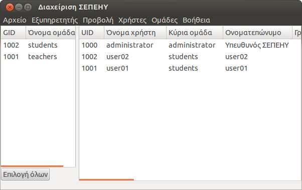

Διαχείριση ΣΕΠΕΗΥ (sch-scripts) {#sch-scripts}
===============================

{.align-right width="40.0%"}

Η εφαρμογή [sch-scripts (Διαχείριση ΣΕΠΕΗΥ)]{.title-ref} είναι ένα
εργαλείο δημιουργίας και παραμετροποίησης ενός εξυπηρετητή LTSP (Linux
Terminal Server Project) σε λειτουργικά συστήματα Ubuntu, που έχει
δημιουργηθεί και υποστηρίζεται από τη δράση της Τεχνικής Στήριξης. Τα
βασικά χαρακτηριστικά της εφαρμογής είναι:

-   Η αυτοματοποίηση της εγκατάστασης του LTSP στα ΣΕΠΕΗΥ,
-   Η αυτοματοποίηση της παραμετροποίησης του LTSP στα ΣΕΠΕΗΥ
-   Η συντήρηση του περιβάλλοντος των LTSP clients (αναβαθμίσεις, νέες
    εκδόσεις κλπ)
-   Η αυτοματοποίηση βασικών εργασιών διαχείρισης όπως
    δημιουργία/επεξεργασία λογαριασμών, δημιουργία κοινόχρηστων φακέλων
    και ομαδοποίηση των χρηστών του συστήματος.

::: {.note}
::: {.admonition-title}
Note
:::

Η εκτέλεση της εφαρμογής `sch-scripts`{.interpreted-text role="ref"} σε
αντίθεση με την [epoptes]{.title-ref} απαιτεί δικαιώματα διαχειριστή
(root).
:::

Χρησιμοποιείστε τα περιεχόμενα για να περιηγηθείτε στο εγχειρίδιο της
[Διαχείρισης ΣΕΠΕΗΥ]{.title-ref}.
